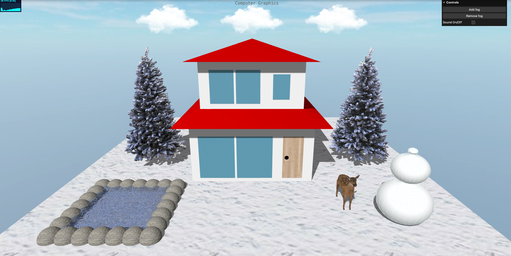
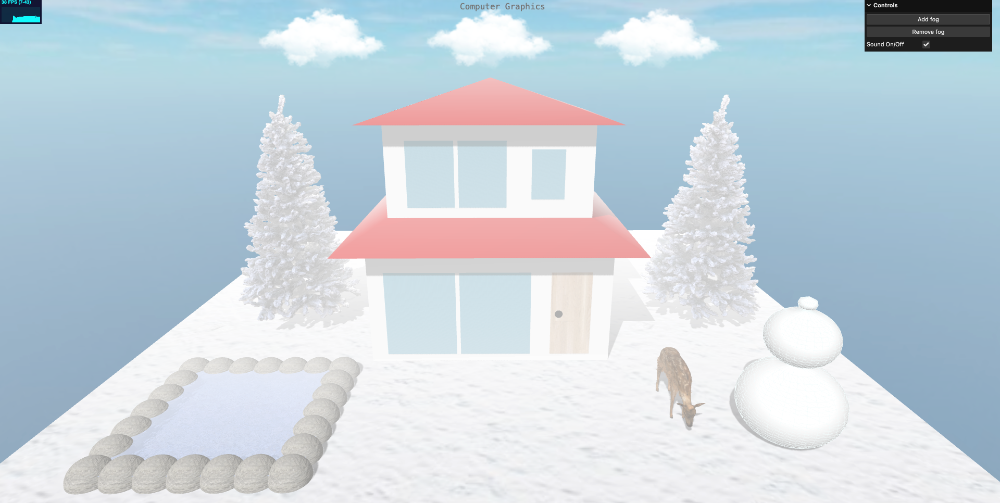
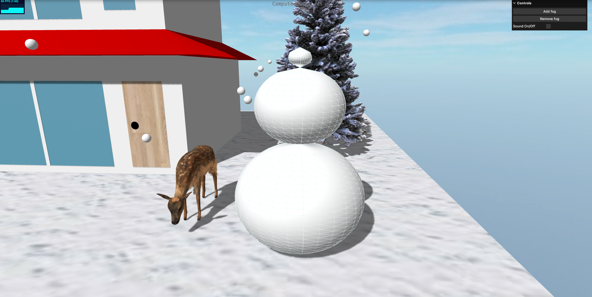
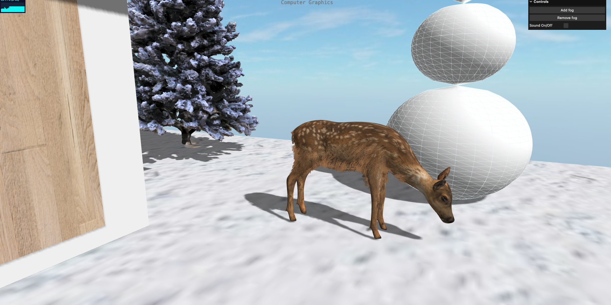
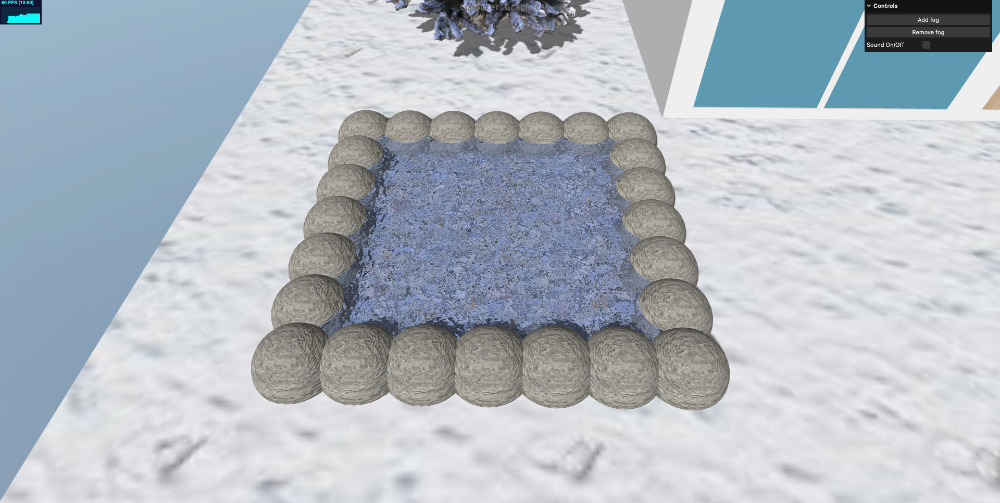

# Christmas-themed 3D animation

https://yunheelim.github.io/christmas-graphics/
## About
- This is the final project for Graphics and Visualization course at Vytautas Magnus University (VMU) in Lithuania.
- This project is made with Three.js which is a JavaScript library that renders 3D objects on the website
- You can feel the Christmas mood on this website.
- You can also manipulate various functions (like making snow to fall, making fog appear, and listening to carol) available on this website.

## Period
2022.11 ~ 2022.12

## Development Environment
- Front-end: HTML, CSS, JavaScript
- Back-end: Live Server
- Library: Three.js, WebGL

## Environment Setting
1. Install Liver Server Extension on Visual Studio Code.
2. Follow the command below in your bash.
```bash
git clone https://github.com/YunheeLim/christmas-graphics.git
```
3. Open the proejct and click on the Go Live button on the bottom right side.
## File Structure
```
 📦Christmas-themed 3D animation/
     └📜README.md
     └📜index.html
     └📂img
     └📂js
      └📜app.js
      └📂mods
       └📜GLTFLoader.js
       └📜OBJLoader.js
       └📜Reflector.js
       └📜SceneUtils.js
       └📜STLLoader.js
       └📜three.module.js
       └📜WebGL.js
     └📂models
      └📂christmas_tree
       └📂textures
       └📜license.txt
       └📜scene.bin
       └📜scene.gltf
      └📂reindeer
     └📂objects
      └📂clouds
      └📂shiba
     └📂sounds
      └📜caro.mp3
     └📂styles
      └📜main.css
```
    
## Detail
### [Main]
- You can rotate 360 degrees with the mouse and also zoom in and out.
- You can also add/remove fog clicking on buttons in the control box on the top right side.
- You can even listen to the Christmas carol checking the Sound On/Off box.



### [Snowman]
- If you click the snowman object, it rotates and the snow is falling on the background.


### [Reindeer]
- This reindeer object is imported by sketchfab.
- The deer moves its neck up and down.


### [Pond]
- You can see the bump texture of the rocks.
- The water in the pond flows in a consistent direction.

